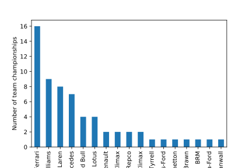
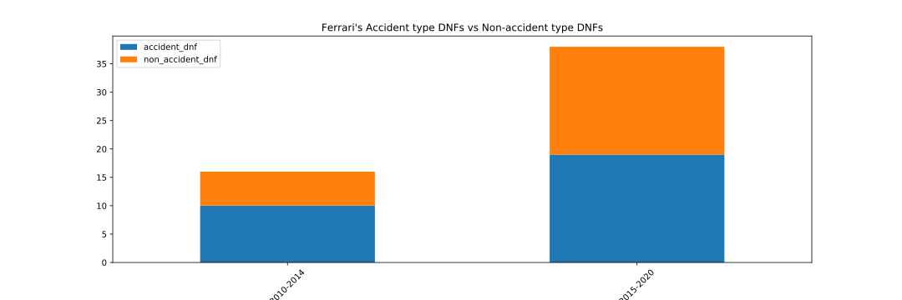
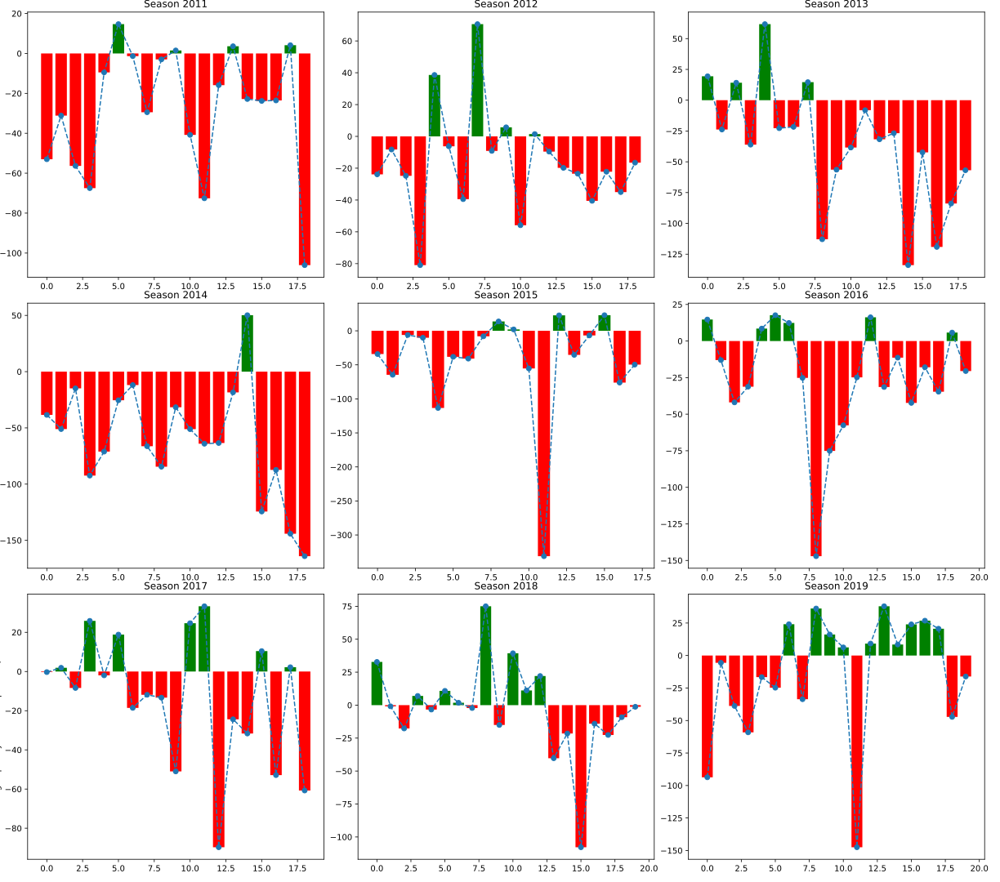

# f1_EDA
With the onset of lockdown restrictions, I found myself with a lot more time on my hands that I was used to. In an attempt to start filling this time up, I started picking up some more hobbies and one of them happened to be watching Formula 1 racing. My journey within this motorsport only started very recently, so when it came to picking a team to support I was a bit clueless. However, after taking a glance at the teams participating one name stood out: 'Scuderia Ferrari'. Growing up, a Ferrari symbolized speed and when I saw it I almost decided to support them. However, after a few searches that did not seem like the best idea. With the team stuck in a downwards spiral, I decided to see if I can figure out what happened.

## Why focus on Ferrari?

Looking at the histogram above, we can see that Ferrari has won the most championships over the course of their time in F!. In fact, they almost double the haul of the team in second place. However, looking at recent results Ferrari has not won a championship in the past 10 years. Surprising isn't it! For a team with so much history, one can only wonder where did it all go wrong?

## Finishing the race
While working with some of the data, there was one trend that I noticed that was a bit surprising. In the last five years, the number of races that the team more than doubled. Normally, when you don't finish a race it tends to fall into one of two categories: mechanical failures or accidents. For Ferrari, both of these happened to occur at a much higher frequency and their inability to field cars that could complete the races became a much bigger issue in the last five years than it was ever before. As we can see below, the increase in accidents in surprising; however, the sharp increase in non-accident stoppages is a much bigger cause of concern.

## Performance over last decade
It is hard to gauge the issues that were occuring within the car due to the data being private, but we can analyze their performance over the past decade to see where it went wrong. For starters, for a team that was so used to being on the top, one would think that constantly coming second or third would lead to better performances in the following season. Sadly, Ferrari could not break their streak of runner-up prizes and even ended up falling all the way to 6th place in the last season. Additionally, we define a new metric called 'Percentage point deficit' which shows how far behind the Ferrari team was from the championship winning team in terms of points. This allows us to better see how competitive they were when they were chasing the number one spot. There were a couple of years like 2012 and 2018 where one could say that the title fight was somewhat close, but the majority of the time they were well away from the top of the table. Finally, we can make a similar observation by observing the point deficit over a moving average of 3 years as seen in the lowest plot below.

## Lap times

Finally, in another attempt to see where it went wrong we look at their race performances by observing the difference between the lap times of the championship winning team and Ferrari. Looking at the plots above, Ferrari just was not competitive enough. The blame could fall on the drivers or the car itself; however, it does not change the fact that the team that is expected to be at the top hasn't done so for a very long time.

## Looking forward
Mercedes and Red Bull have far outperformed Ferrari in the recent years and it does not look like their dominance is going to fizzle out anytime soon. However, Ferrari have coe into the 2021 season with two young and fast drivers and with some discipline and ingenuity they can at the very least recover from the 6th place from the 2020 season and look into the 2022 season that will bring upon a variety of rule changes. Perhaps, those changes could serve as a rebound for a struggling Ferrari team or could they only make matters worse. Only time will tell.
